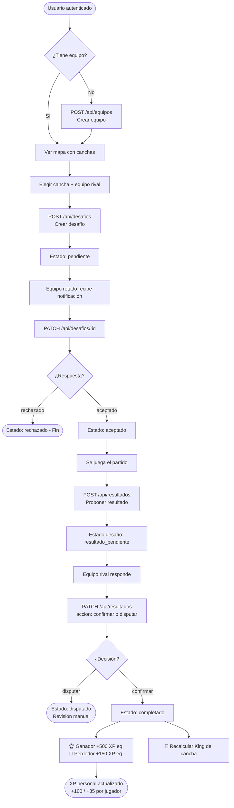
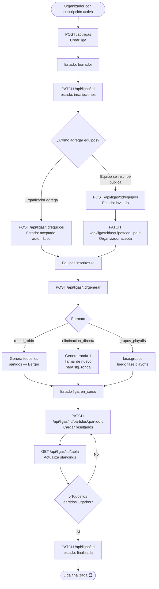
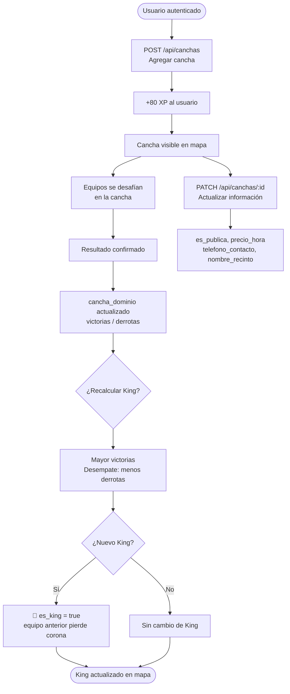
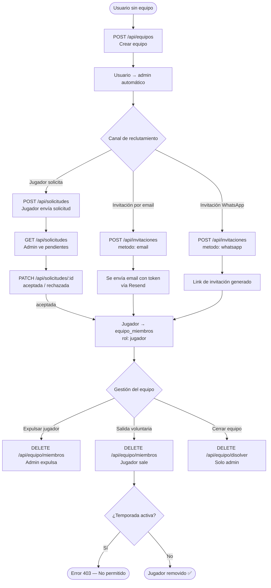

# KOTC — Documentación de API

> **Base URL:** `http://localhost:3000/api` (local) · `https://kotc.vercel.app/api` (prod)
>
> **Autenticación:** Supabase session cookie. Después de hacer login en el navegador, copia la cookie `sb-<project>-auth-token` desde DevTools → Application → Cookies y pégala como header `Cookie` en Bruno.

---

## Índice

1. [Autenticación](#autenticación)
2. [Canchas](#canchas)
3. [Equipos](#equipos)
4. [Invitaciones](#invitaciones)
5. [Solicitudes](#solicitudes)
6. [Equipo — miembros y disolución](#equipo--miembros-y-disolución)
7. [Desafíos](#desafíos)
8. [Resultados](#resultados)
9. [Perfil](#perfil)
10. [Ligas](#ligas)
11. [Diagramas de flujo](#diagramas-de-flujo)
12. [Modelos de datos](#modelos-de-datos)

---

## Autenticación

Todos los endpoints marcados con 🔒 requieren cookie de sesión activa.
Los endpoints marcados con 🏆 requieren además suscripción activa en `suscripciones`.

| Campo | Descripción |
|-------|-------------|
| Cookie | `sb-<projectref>-auth-token=<base64>` |
| Sin sesión | `{ "error": "No autenticado" }` → `401` |
| Sin suscripción | `{ "error": "Necesitas una suscripción activa..." }` → `403` |

---

## Canchas

### `GET /api/canchas` — Listar canchas

Público. Devuelve todas las canchas con su dominio actual.

**Query params (opcionales):**
| Param | Tipo | Ejemplo |
|-------|------|---------|
| `deporte` | string | `basketball` |

**Response `200`:**
```json
[
  {
    "id": "uuid",
    "nombre": "Cancha Los Leones",
    "direccion": "Av. Los Leones 1234, Providencia",
    "lat": -33.4334,
    "lng": -70.6152,
    "deporte": ["basketball"],
    "validada": false,
    "es_publica": true,
    "precio_hora": null,
    "telefono_contacto": null,
    "nombre_recinto": null,
    "cancha_dominio": [
      {
        "id": "uuid",
        "equipo_id": "uuid",
        "victorias": 5,
        "derrotas": 2,
        "es_king": true,
        "equipos": { "id": "uuid", "nombre": "Los Tigres", "color": "#F5C344" }
      }
    ]
  }
]
```

---

### `POST /api/canchas` 🔒 — Crear cancha

El usuario gana **+80 XP** al agregar una cancha.

**Body:**
```json
{
  "nombre": "Cancha Los Leones",
  "direccion": "Av. Los Leones 1234, Providencia",
  "lat": -33.4334,
  "lng": -70.6152,
  "deporte": ["basketball"],
  "es_publica": true,
  "precio_hora": null,
  "telefono_contacto": null,
  "nombre_recinto": null,
  "horarios": {
    "lunes":   { "apertura": "08:00", "cierre": "22:00" },
    "sabado":  { "apertura": "09:00", "cierre": "18:00" }
  }
}
```

**Campos requeridos:** `nombre`, `direccion`, `lat`, `lng`, `deporte`

**Response `201`:**
```json
{
  "cancha": { "id": "uuid", "nombre": "...", "...": "..." },
  "xp_ganado": 80
}
```

---

### `GET /api/canchas/:id` — Detalle de cancha

**Response `200`:**
```json
{
  "id": "uuid",
  "nombre": "Cancha Los Leones",
  "direccion": "...",
  "lat": -33.4334,
  "lng": -70.6152,
  "deporte": ["basketball"],
  "es_publica": false,
  "precio_hora": 12000,
  "telefono_contacto": "+56912345678",
  "nombre_recinto": "Complejo Deportivo Los Leones",
  "horarios": {},
  "validada": false,
  "cancha_dominio": [...]
}
```

---

### `PATCH /api/canchas/:id` 🔒 — Actualizar cancha

**Body (todos los campos requeridos):**
```json
{
  "nombre": "Cancha Los Leones (Renovada)",
  "direccion": "Av. Los Leones 1234, Providencia",
  "lat": -33.4334,
  "lng": -70.6152,
  "deporte": ["basketball", "futbol"],
  "es_publica": false,
  "precio_hora": 12000,
  "telefono_contacto": "+56912345678",
  "nombre_recinto": "Complejo Deportivo Los Leones"
}
```

**Response `200`:**
```json
{ "cancha": { "id": "uuid", "...": "..." } }
```

---

## Equipos

### `GET /api/equipos` — Listar equipos

Ordenados por XP descendente.

**Query params (opcionales):** `ciudad`, `deporte`

**Response `200`:** Array de equipos con `equipo_miembros(count)`.

---

### `POST /api/equipos` 🔒 — Crear equipo

El creador queda automáticamente como **admin**.

**Body:**
```json
{
  "nombre": "Los Tigres",
  "deporte": "basketball",
  "ciudad": "Santiago",
  "color": "#F5C344",
  "descripcion": "Equipo de basketball de Providencia"
}
```

**Response `201`:** Objeto equipo completo.

---

## Invitaciones

### `POST /api/invitaciones` 🔒 — Crear invitación

Genera un token de invitación. Si `metodo = "email"` y `RESEND_API_KEY` está configurada, envía email automáticamente.

**Body:**
```json
{
  "equipo_id": "uuid",
  "metodo": "email",
  "valor": "jugador@ejemplo.com"
}
```

```json
{
  "equipo_id": "uuid",
  "metodo": "whatsapp",
  "valor": "+56912345678"
}
```

**`metodo`:** `"email"` | `"whatsapp"`

**Response `201`:** Objeto invitación con `token`.

---

### `GET /api/invitaciones?equipo_id=:id` 🔒 — Listar invitaciones del equipo

---

## Solicitudes

### `POST /api/solicitudes` 🔒 — Enviar solicitud de ingreso

**Body:**
```json
{
  "equipo_id": "uuid",
  "mensaje": "Quiero unirme al equipo."
}
```

**Response `201`:** Objeto solicitud. `409` si ya existe solicitud pendiente.

---

### `GET /api/solicitudes` 🔒 — Ver solicitudes

| Query `tipo` | Descripción |
|---|---|
| *(vacío)* | Admin/capitán ve solicitudes pendientes de su equipo |
| `mias` | Jugador ve sus propias solicitudes |

**Response `200` (sin tipo — como admin):**
```json
[
  {
    "id": "uuid",
    "jugador_id": "uuid",
    "estado": "pendiente",
    "mensaje": "...",
    "profiles": {
      "username": "carlosperez",
      "display_name": "Carlos Pérez",
      "nivel": 5,
      "xp": 2400,
      "posicion_principal": "alero",
      "disponible_reclutamiento": true
    }
  }
]
```

---

### `PATCH /api/solicitudes/:id` 🔒 — Responder solicitud (admin)

**Body:**
```json
{ "estado": "aceptada" }
```

**`estado`:** `"aceptada"` | `"rechazada"` | `"cancelada"`

Al aceptar, el jugador se agrega automáticamente a `equipo_miembros` con `rol: "jugador"`.

---

### `DELETE /api/solicitudes/:id` 🔒 — Cancelar solicitud (propio jugador)

---

## Equipo — miembros y disolución

### `DELETE /api/equipo/miembros` 🔒 — Remover miembro

Un **admin** puede expulsar jugadores. Un **jugador** puede salir voluntariamente (no si temporada activa). El admin no puede salir — debe disolver.

**Body:**
```json
{ "miembro_id": "uuid-de-equipo_miembros" }
```

---

### `DELETE /api/equipo/disolver` 🔒 — Disolver equipo (solo admin)

Elimina el equipo y todos sus miembros. No funciona si hay temporada activa en curso.

---

## Desafíos

### `GET /api/desafios` 🔒 — Listar desafíos de mi equipo

Devuelve desafíos donde el equipo del usuario es retador o retado, con datos de equipos y cancha enriquecidos.

**Response `200`:**
```json
{
  "desafios": [
    {
      "id": "uuid",
      "equipo_retador_id": "uuid",
      "equipo_retado_id": "uuid",
      "estado": "pendiente",
      "deporte": "basketball",
      "formato": "3v3",
      "fecha": "2026-06-15T18:00:00.000Z",
      "mensaje": "Los retamos en su cancha.",
      "equipo_retador": { "id": "uuid", "nombre": "Los Tigres", "color": "#F5C344" },
      "equipo_retado":  { "id": "uuid", "nombre": "Los Leones",  "color": "#4488FF" },
      "cancha": { "id": "uuid", "nombre": "Cancha Los Leones", "direccion": "..." }
    }
  ],
  "equipoId": "uuid-de-mi-equipo"
}
```

---

### `POST /api/desafios` 🔒 — Crear desafío

**Body:**
```json
{
  "equipo_retado_id": "uuid",
  "cancha_id": "uuid",
  "deporte": "basketball",
  "formato": "3v3",
  "fecha": "2026-06-15T18:00:00.000Z",
  "mensaje": "¿Aceptan el desafío?"
}
```

**Campos requeridos:** `equipo_retado_id`, `cancha_id`, `deporte`, `formato`, `fecha`

**Response `201`:** `{ "desafio": { ...objeto enriquecido } }`

---

### `PATCH /api/desafios/:id` 🔒 — Actualizar estado

| Estado | Quién puede | Desde estado |
|--------|-------------|--------------|
| `aceptado` | Equipo retado | `pendiente` |
| `rechazado` | Equipo retado | `pendiente` |
| `jugado` | Cualquier participante | `aceptado` |

**Body:**
```json
{ "estado": "aceptado" }
```

---

## Resultados

### `POST /api/resultados` 🔒 — Proponer resultado

Solo lo puede hacer un participante del desafío. El desafío pasa a `resultado_pendiente`.

**Body:**
```json
{
  "desafio_id": "uuid",
  "ganador_id": "uuid-del-equipo-ganador",
  "puntos_retador": 21,
  "puntos_retado": 14
}
```

**Response `201`:** `{ "resultado": { ...objeto } }`

---

### `PATCH /api/resultados` 🔒 — Confirmar o disputar

Solo el equipo que **no** propuso puede confirmar o disputar.

**Body:**
```json
{ "id": "uuid-del-resultado", "accion": "confirmar" }
```

```json
{ "id": "uuid-del-resultado", "accion": "disputar" }
```

**`accion`:** `"confirmar"` | `"disputar"`

**Al confirmar se ejecuta automáticamente:**
- 🏆 Equipo ganador: **+500 XP**
- 🥉 Equipo perdedor: **+150 XP**
- 👤 Jugadores ganadores: **+100 XP** (auto-nivel)
- 👤 Jugadores perdedores: **+35 XP** (auto-nivel)
- 🏟️ `cancha_dominio` actualizado (victorias/derrotas)
- 👑 King recalculado (mayor victorias, desempate por menos derrotas)

---

## Perfil

### `PATCH /api/perfil` 🔒 — Actualizar perfil

Campos opcionales — solo se actualizan los que se envíen.

**Body (cualquier subconjunto):**
```json
{
  "display_name": "Carlos Pérez",
  "bio": "Jugador de basketball desde los 15.",
  "posicion_principal": "alero",
  "posiciones_adicionales": ["base", "escolta"],
  "especialidades": ["tiro_3", "defensa"],
  "altura_cm": 185,
  "peso_kg": 80,
  "mano_habil": "derecha",
  "anos_experiencia": 8,
  "disponible_reclutamiento": true,
  "ciudad": "Santiago"
}
```

---

## Ligas

### `GET /api/ligas` — Listar ligas

Público. Excluye borradores que no son del usuario actual.

**Response `200`:**
```json
{
  "ligas": [
    {
      "id": "uuid",
      "nombre": "Liga Santiago Basketball 2026",
      "deporte": "basketball",
      "modalidad": "5v5",
      "formato": "round_robin",
      "estado": "inscripciones",
      "max_equipos": 8,
      "inscripcion_publica": true,
      "fecha_inicio": "2026-07-01",
      "fecha_fin": "2026-09-30",
      "organizador_id": "uuid",
      "liga_equipos": [{ "count": 5 }]
    }
  ]
}
```

**`estado`:** `borrador` → `inscripciones` → `en_curso` → `finalizada` | `cancelada`

---

### `POST /api/ligas` 🔒 🏆 — Crear liga

Requiere suscripción `organizador` activa.

**Body (round_robin):**
```json
{
  "nombre": "Liga Santiago Basketball 2026",
  "descripcion": "Liga oficial de basketball amateur",
  "deporte": "basketball",
  "modalidad": "5v5",
  "formato": "round_robin",
  "max_equipos": 8,
  "inscripcion_publica": true,
  "fecha_inicio": "2026-07-01",
  "fecha_fin": "2026-09-30",
  "puntos_victoria": 3,
  "puntos_empate": 1,
  "puntos_derrota": 0
}
```

**Body adicional para `grupos_playoffs`:**
```json
{
  "formato": "grupos_playoffs",
  "num_grupos": 4,
  "equipos_clasifican": 2
}
```

**`formato`:** `round_robin` | `eliminacion_directa` | `grupos_playoffs`

**Response `201`:** `{ "liga": { "id": "uuid" } }`

---

### `GET /api/ligas/:id` — Detalle de liga

Incluye equipos inscritos con datos del equipo.

---

### `PATCH /api/ligas/:id` 🔒 — Actualizar liga (solo organizador)

Acepta cualquier subconjunto de campos permitidos. También maneja **transiciones de estado**:

| Desde | Hacia |
|-------|-------|
| `borrador` | `inscripciones` \| `cancelada` |
| `inscripciones` | `en_curso` \| `cancelada` |
| `en_curso` | `finalizada` \| `cancelada` |

**Body:**
```json
{
  "estado": "inscripciones"
}
```

**Response `200`:** `{ "ok": true }`

---

### `DELETE /api/ligas/:id` 🔒 — Eliminar liga

No se puede eliminar mientras está `en_curso`. Debe cancelarse primero.

---

### `GET /api/ligas/:id/equipos` — Equipos inscritos

**Response `200`:**
```json
{
  "equipos": [
    {
      "id": "uuid-liga_equipo",
      "equipo_id": "uuid",
      "estado": "aceptado",
      "grupo": "A",
      "seed": 1,
      "equipos": { "id": "uuid", "nombre": "Los Tigres", "color": "#F5C344", "ciudad": "Santiago" }
    }
  ]
}
```

**`estado`:** `invitado` | `aceptado` | `rechazado`

---

### `POST /api/ligas/:id/equipos` 🔒 — Inscribir equipo

- **Organizador:** auto-acepta (`estado: aceptado`)
- **Capitán en liga pública (inscripciones):** queda `invitado` hasta que organizer acepte

**Body:**
```json
{ "equipo_id": "uuid" }
```

---

### `PATCH /api/ligas/:id/equipos/:equipoId` 🔒 — Gestionar inscripción

**Organizador puede enviar:**
```json
{ "estado": "aceptado", "grupo": "A", "seed": 1 }
```

**Capitán del equipo puede enviar:**
```json
{ "estado": "aceptado" }
```
```json
{ "estado": "rechazado" }
```

---

### `DELETE /api/ligas/:id/equipos/:equipoId` 🔒 — Retirar equipo

Organizador puede retirar en cualquier estado (excepto `en_curso`). Capitán puede retirarse si la liga no está `en_curso`.

---

### `POST /api/ligas/:id/generar` 🔒 — Generar calendario

Solo el organizador. Transiciona la liga a `en_curso` la primera vez.

| Formato | Body | Comportamiento |
|---------|------|----------------|
| `round_robin` | `{}` | Genera todos los partidos de una vez (algoritmo Berger) |
| `eliminacion_directa` | `{}` | Genera la siguiente ronda (llamar repetidamente) |
| `grupos_playoffs` | `{ "fase": "grupos" }` | Genera partidos de fase grupal |
| `grupos_playoffs` | `{ "fase": "playoffs" }` | Genera bracket de playoffs desde clasificados |

**Mínimo 2 equipos aceptados.**

**Response `200`:**
```json
{
  "ok": true,
  "partidosCreados": 12,
  "ronda": 1
}
```

---

### `GET /api/ligas/:id/partidos` — Partidos de la liga

**Query params (opcionales):** `fase`, `grupo`, `ronda`, `estado`

**Response `200`:**
```json
{
  "partidos": [
    {
      "id": "uuid",
      "ronda": 1,
      "fase": "grupos",
      "grupo": "A",
      "estado": "pendiente",
      "fecha": null,
      "puntos_local": null,
      "puntos_visitante": null,
      "ganador_id": null,
      "equipo_local":     { "id": "uuid", "nombre": "Los Tigres", "color": "#F5C344" },
      "equipo_visitante": { "id": "uuid", "nombre": "Los Leones",  "color": "#4488FF" },
      "canchas": null
    }
  ]
}
```

**`estado`:** `pendiente` | `completado`

---

### `PATCH /api/ligas/:id/partidos/:partidoId` 🔒 — Cargar resultado de partido

Solo el organizador. Calcula `ganador_id` automáticamente (empate → `null`).

**Body:**
```json
{
  "puntos_local": 78,
  "puntos_visitante": 65,
  "fecha": "2026-07-10T19:00:00.000Z",
  "cancha_id": "uuid"
}
```

**`fecha` y `cancha_id` son opcionales.**

**Response `200`:** `{ "ok": true }`

---

### `GET /api/ligas/:id/tabla` — Tabla de posiciones

**Response `200` (round_robin):**
```json
{
  "tipo": "tabla",
  "tabla": [
    {
      "equipo_id": "uuid",
      "nombre": "Los Tigres",
      "color": "#F5C344",
      "pj": 6,
      "pg": 4,
      "pe": 1,
      "pp": 1,
      "gf": 320,
      "gc": 240,
      "dg": 80,
      "pts": 13
    }
  ]
}
```

**Response `200` (grupos_playoffs):**
```json
{
  "tipo": "grupos",
  "tabla": {
    "A": [ ...StandingRow ],
    "B": [ ...StandingRow ]
  }
}
```

**Response `200` (eliminacion_directa):**
```json
{ "tipo": "bracket", "tabla": [] }
```

---

## Diagramas de flujo

### 1. Flujo completo de Desafíos



---

### 2. Flujo de Ligas



---

### 3. Flujo de Canchas y Dominio



---

### 4. Flujo de Equipo y Reclutamiento



---

## Modelos de datos

### `cancha`
| Campo | Tipo | Descripción |
|-------|------|-------------|
| `id` | uuid | PK |
| `nombre` | text | Nombre de la cancha |
| `direccion` | text | Dirección completa |
| `lat` | float8 | Latitud |
| `lng` | float8 | Longitud |
| `deporte` | text[] | Deportes (ej. `["basketball"]`) |
| `es_publica` | boolean | `true` = acceso libre, `false` = de pago |
| `precio_hora` | integer\|null | Precio en CLP por hora |
| `telefono_contacto` | text\|null | Teléfono con prefijo (ej. `+56912345678`) |
| `nombre_recinto` | text\|null | Nombre del complejo/recinto |
| `horarios` | jsonb | `{ "lunes": { "apertura": "08:00", "cierre": "22:00" } }` |
| `validada` | boolean | Validada por admin |
| `agregada_por` | uuid | FK → auth.users |

### `equipo`
| Campo | Tipo | Descripción |
|-------|------|-------------|
| `id` | uuid | PK |
| `nombre` | text | Nombre del equipo |
| `deporte` | text | Deporte principal |
| `ciudad` | text | Ciudad |
| `color` | text | Color hex (`#F5C344`) |
| `xp` | integer | XP total del equipo |
| `creador_id` | uuid | FK → auth.users |

### `desafio`
| Campo | Tipo | Descripción |
|-------|------|-------------|
| `id` | uuid | PK |
| `equipo_retador_id` | uuid | FK → equipos |
| `equipo_retado_id` | uuid | FK → equipos |
| `cancha_id` | uuid | FK → canchas |
| `deporte` | text | Deporte del desafío |
| `formato` | text | Ej. `3v3`, `5v5` |
| `fecha` | timestamptz | Fecha/hora del partido |
| `estado` | text | `pendiente` \| `aceptado` \| `rechazado` \| `resultado_pendiente` \| `completado` \| `disputado` |
| `mensaje` | text\|null | Mensaje del retador |

### `resultado`
| Campo | Tipo | Descripción |
|-------|------|-------------|
| `id` | uuid | PK |
| `desafio_id` | uuid | FK → desafios |
| `ganador_id` | uuid | FK → equipos |
| `propuesto_por` | uuid | FK → equipos |
| `puntos_retador` | integer\|null | Marcador |
| `puntos_retado` | integer\|null | Marcador |
| `confirmado_por_perdedor` | boolean | |
| `disputado` | boolean | |

### `liga`
| Campo | Tipo | Descripción |
|-------|------|-------------|
| `id` | uuid | PK |
| `nombre` | text | |
| `deporte` | text | |
| `modalidad` | text | Ej. `5v5`, `3v3` |
| `formato` | text | `round_robin` \| `eliminacion_directa` \| `grupos_playoffs` |
| `estado` | text | `borrador` → `inscripciones` → `en_curso` → `finalizada` \| `cancelada` |
| `max_equipos` | integer | Default: 8 |
| `inscripcion_publica` | boolean | |
| `puntos_victoria` | integer | Default: 3 |
| `puntos_empate` | integer | Default: 1 |
| `puntos_derrota` | integer | Default: 0 |
| `num_grupos` | integer\|null | Solo `grupos_playoffs` |
| `equipos_clasifican` | integer\|null | Solo `grupos_playoffs` |
| `organizador_id` | uuid | FK → auth.users |

### `liga_equipo` (inscripción)
| Campo | Tipo | Descripción |
|-------|------|-------------|
| `id` | uuid | PK |
| `liga_id` | uuid | FK → ligas |
| `equipo_id` | uuid | FK → equipos |
| `estado` | text | `invitado` \| `aceptado` \| `rechazado` |
| `grupo` | text\|null | Ej. `"A"`, `"B"` |
| `seed` | integer\|null | Semilla para bracket |

### `liga_partido`
| Campo | Tipo | Descripción |
|-------|------|-------------|
| `id` | uuid | PK |
| `liga_id` | uuid | FK → ligas |
| `equipo_local_id` | uuid | FK → equipos |
| `equipo_visitante_id` | uuid | FK → equipos |
| `ronda` | integer | Número de ronda/jornada |
| `fase` | text | `grupos` \| `playoffs` \| `round_robin` |
| `grupo` | text\|null | Grupo (si aplica) |
| `estado` | text | `pendiente` \| `completado` |
| `puntos_local` | integer\|null | |
| `puntos_visitante` | integer\|null | |
| `ganador_id` | uuid\|null | null = empate |
| `fecha` | timestamptz\|null | |
| `cancha_id` | uuid\|null | FK → canchas |

### `suscripcion`
| Campo | Tipo | Descripción |
|-------|------|-------------|
| `id` | uuid | PK |
| `user_id` | uuid | FK → auth.users |
| `plan` | text | `organizador` |
| `estado` | text | `activa` \| `inactiva` \| `cancelada` |
| `fecha_inicio` | date | |
| `fecha_fin` | date | |

---

## Configurar autenticación en Bruno

1. Inicia sesión en la app (`/login`)
2. Abre DevTools → Application → Cookies → `localhost:3000`
3. Copia el valor de `sb-<projectref>-auth-token`
4. En Bruno: Environment → `local` → `authCookie` → pega el valor
5. Todos los requests que usen `Cookie: {{authCookie}}` quedarán autenticados

> ⚠️ La cookie expira (por defecto 1 hora). Si recibes `401`, renuévala.
